# Добавление одежды

## Требования

1. [gtautil](https://github.com/indilo53/gtautil)
2. [OpenIV](https://openiv.com) (опционально)
3. [YMTEditor](https://github.com/grzybeek/YMTEditor)
4. [Шаблон](../template/ccdclothes.zip) будущего DLC

## Подготовка

Шаблон будущего DLC отображает структуру архива dlc.rpf:

```
ccdclothes
│   content.xml
│   setup2.xml
│
└───common
│   └───data
│       │   mp_f_freemode_01_ccdclothes_shop.meta        # метадата женской одежды
│       │   mp_m_freemode_01_ccdclothes_shop.meta        # метадата мужской одежды
│
└───x64
    └───models
        └───cdimages
            └───ccdclothes_f.rpf                         # женская одежда
            │   │   mp_creaturemetadata_ccdclothes.ymt   # метадата пропов (генерируется YMTEditor)
            │   │   mp_f_freemode_01_ccdclothes.ymt      # метадата одежды (генерируется YMTEditor)
            │   │
            │   └───mp_m_freemode_01_ccdclothes          # одежда
            │   │   │   feet_000_u.ydd                   # модель
            │   │   │   feet_001_u.ydd
            │   │   │   feet_diff_000_a_uni.ytd          # текстуры
            │   │   │   feet_diff_000_b_uni.ytd
            │   │   │   feet_diff_001_a_uni.ytd
            │   │   │   feet_diff_001_b_uni.ytd
            │   │   │
            │   │   
            │   └───mp_m_freemode_01_p_ccdclothes        # пропы (шапки и т.д.)
            │       │   p_head_000.ydd
            │       │   p_head_001.ydd
            │       │   p_head_diff_000_a.ytd
            │       │   p_head_diff_001_a.ytd
            │       │
            │
            └───ccdclothes_m.rpf                         # мужская одежда
                │   mp_creaturemetadata_ccdclothes.ymt   # метадата пропов (генерируется YMTEditor)
                │   mp_m_freemode_01_ccdclothes.ymt      # метадата одежды (генерируется YMTEditor)
                │
                └───mp_m_freemode_01_ccdclothes          # одежда
                │   │   feet_000_u.ydd                   # модель
                │   │   feet_001_u.ydd
                │   │   feet_diff_000_a_uni.ytd          # текстуры
                │   │   feet_diff_000_b_uni.ytd
                │   │   feet_diff_001_a_uni.ytd
                │   │   feet_diff_001_b_uni.ytd
                │   │
                │
                └───mp_m_freemode_01_p_ccdclothes        # пропы (шапки и т.д.)
                    │   p_head_000.ydd
                    │   p_head_001.ydd
                    │   p_head_diff_000_a.ytd
                    │   p_head_diff_001_a.ytd
                    │
```

Для изменения имени dlc необходимо заменить `ccdclothes` на целевое имя dlc в названиях всех директорий в названиях и в содержимом файлов `setup2.xml`, `content.xml`, `mp_f_freemode_01_ccdclothes_shop.meta`, `mp_m_freemode_01_ccdclothes_shop.meta`

## Инструкция

1. Поместить шаблон dlc в директорию с GTAUtil.exe:

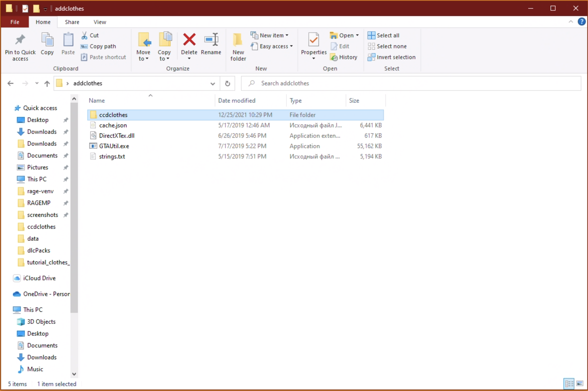

2. Поместить файлы одежды (модели с текстурами, `.ydd` и `.ytd` файлы) в `x64\models\cdimages\ccdclothes_m.rpf\mp_m_freemode_01_ccdclothes`, пропы в `x64\models\cdimages\ccdclothes_m.rpf\mp_m_freemode_01_p_ccdclothes`.

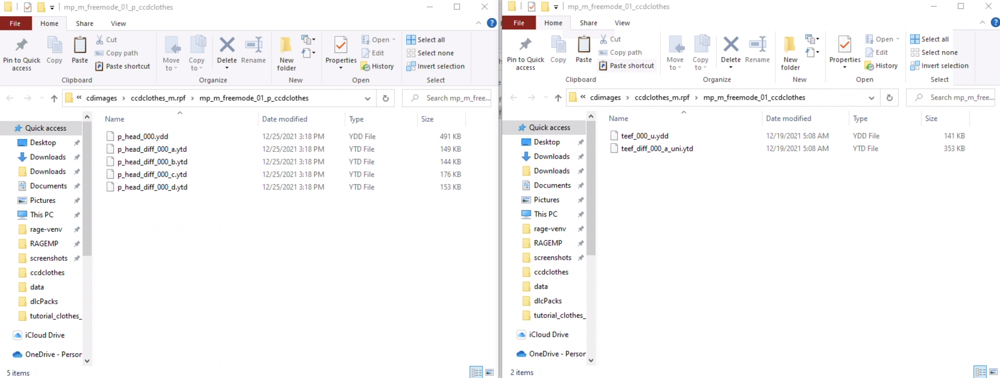

3. Сгенерировать метадату через YMTEditor.
   1. Нажать File - New:

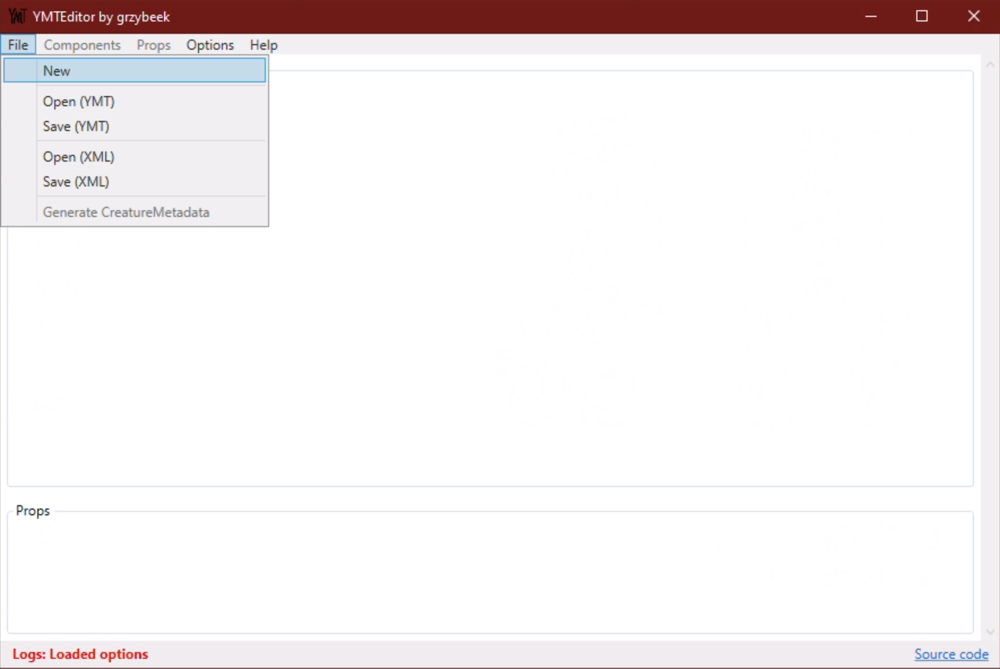

   2. Выбрать пол персонажа, для которого добавляется одежда, и ввести название dlc:

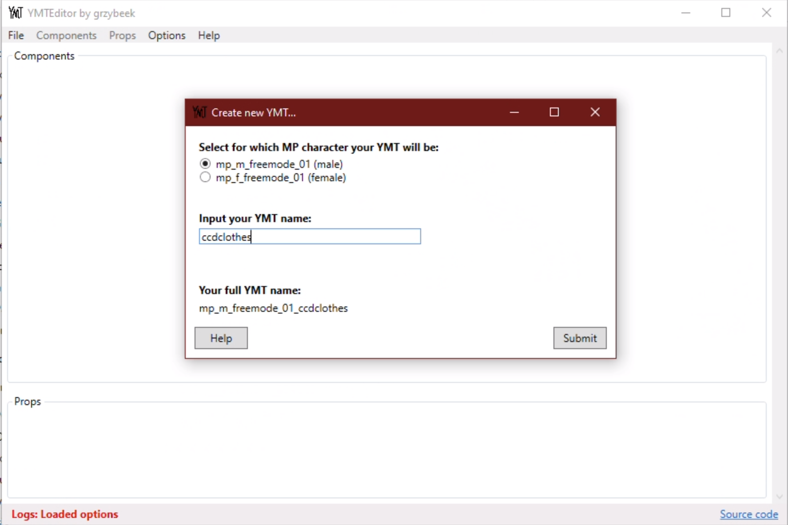

   3. Включить добавляемые компоненты и пропы:

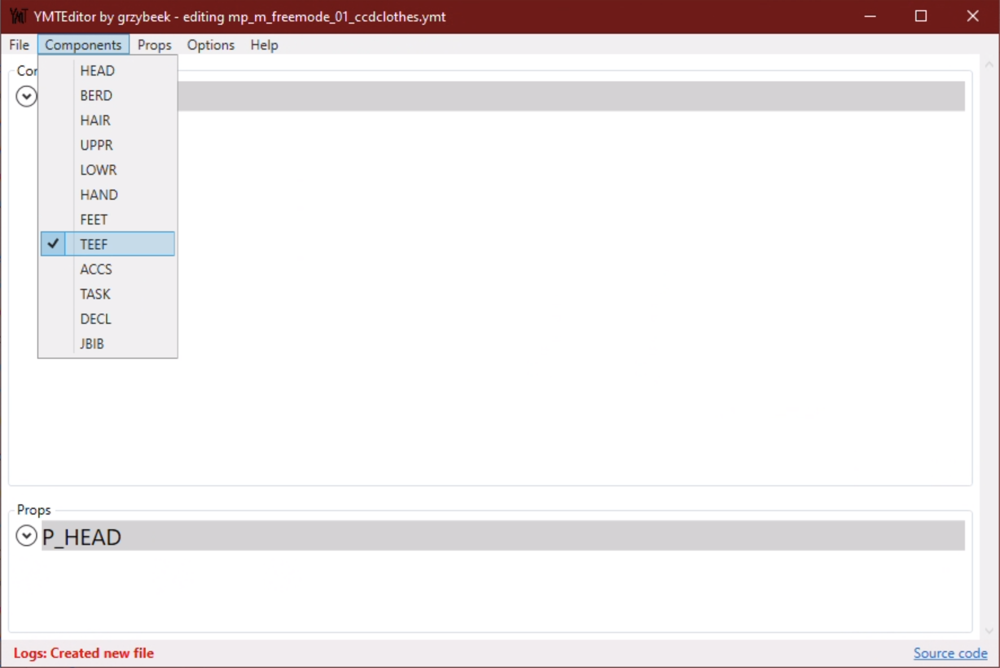
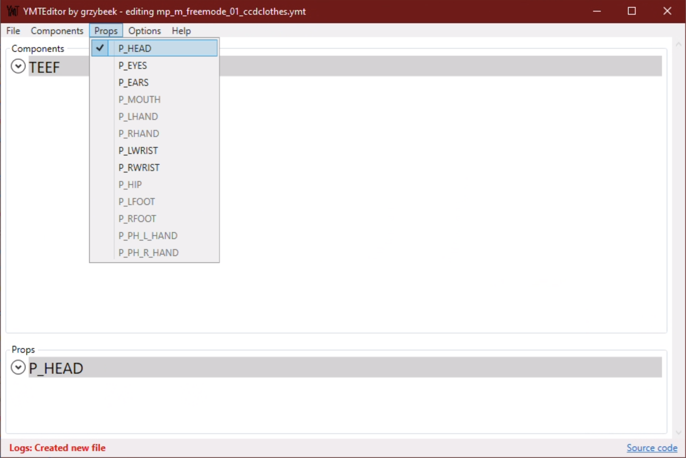

   4. Добавить соответствующее количество моделей (номера должны соответствовать номерам в именах файлов):

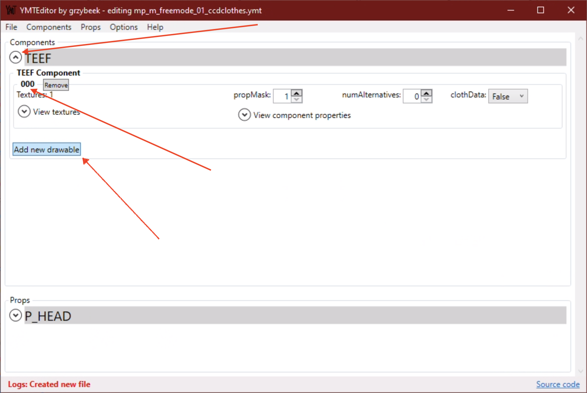

   5. Для каждой модели добавить соответствующее количество текстур. В texID Value выбрать постфикс, присутствует в названии файлов текстур для соответствующей модели (напр. `teef_diff_000_a_uni.ytd`, постфикс `_uni`):

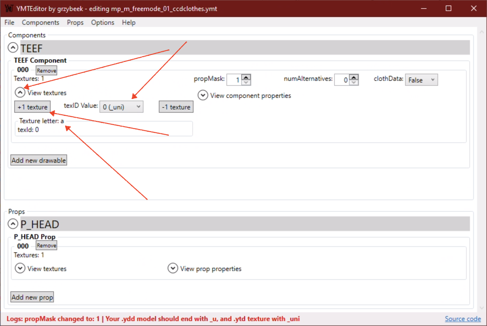

   6. **Для шапок** (при наличии) дополнительно задать уровень скрытия волос (`-1` полностью скрывает волосы). Наиболее распространённое значение `-0.5`.

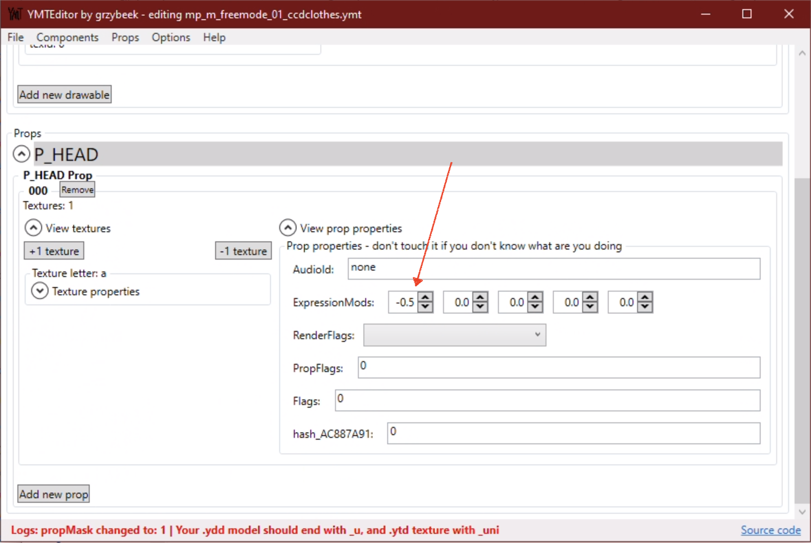

   7. Сохранить полученный ymt (`File - Save (YMT)`) в директорию `x64\models\cdimages\ccdclothes_m.rpf\` для мужского персонажа и в директорию `x64\models\cdimages\ccdclothes_f.rpf\` для женского.

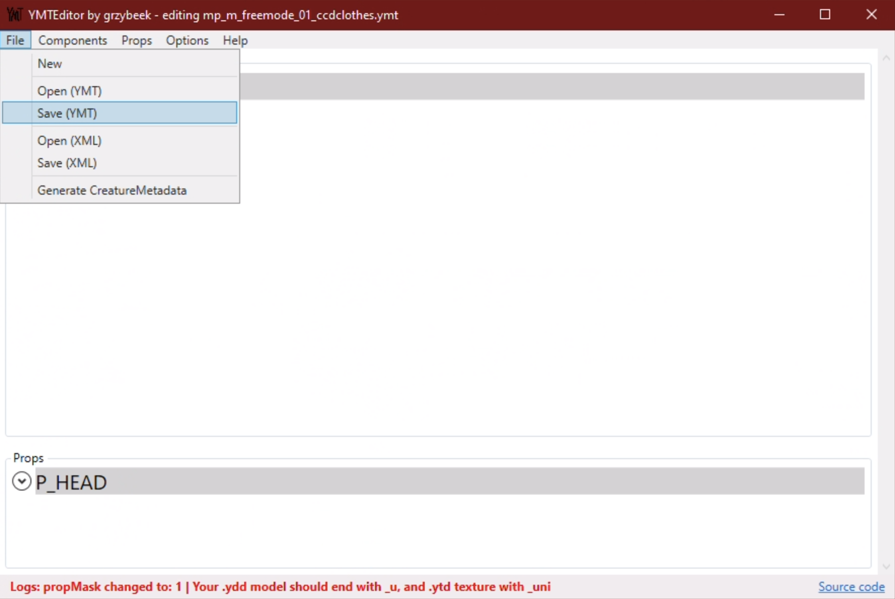
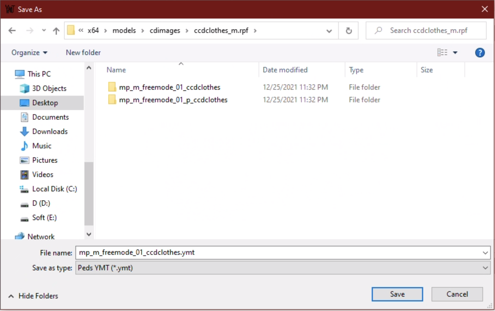

   8. Сгенерировать CreatureMetadata (`File - Generate CreatureMetadata`) в ту же директорию, куда был сохранён ymt (`x64\models\cdimages\ccdclothes_m.rpf\` и/или `x64\models\cdimages\ccdclothes_f.rpf\`).

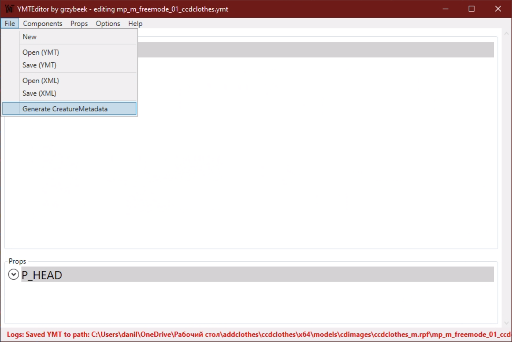
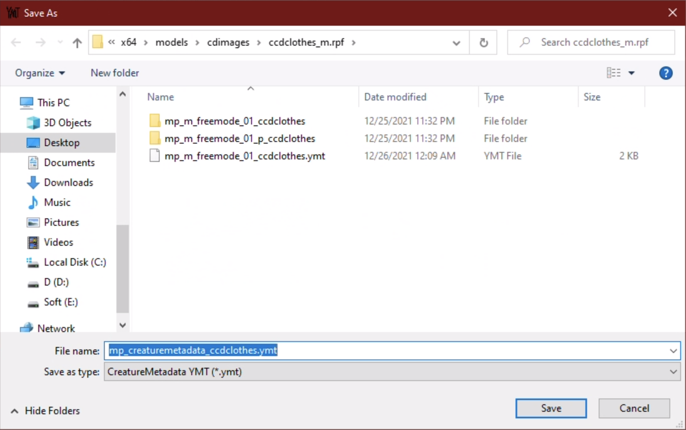

   9. Собрать полученный dlc (PowerShell/CMD):

```powershell
.\GTAUtil.exe createarchive -i ccdclothes -o . -n dlc
```
